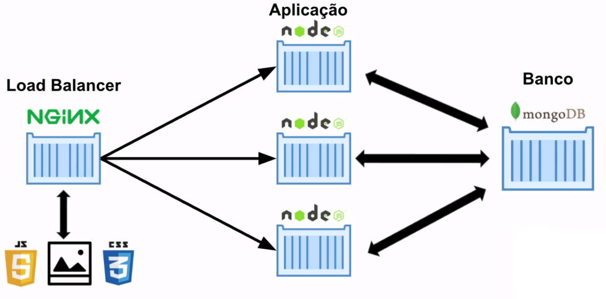

# Projeto Docker-compose
## Arquitura dos serviço levantados

    
    * 1 nginx
    * 3 aplicações node
    * 1 banco mongo

## Inicializar docker-compose
```shell
    > docker-compose build
    > docker-compose up
```